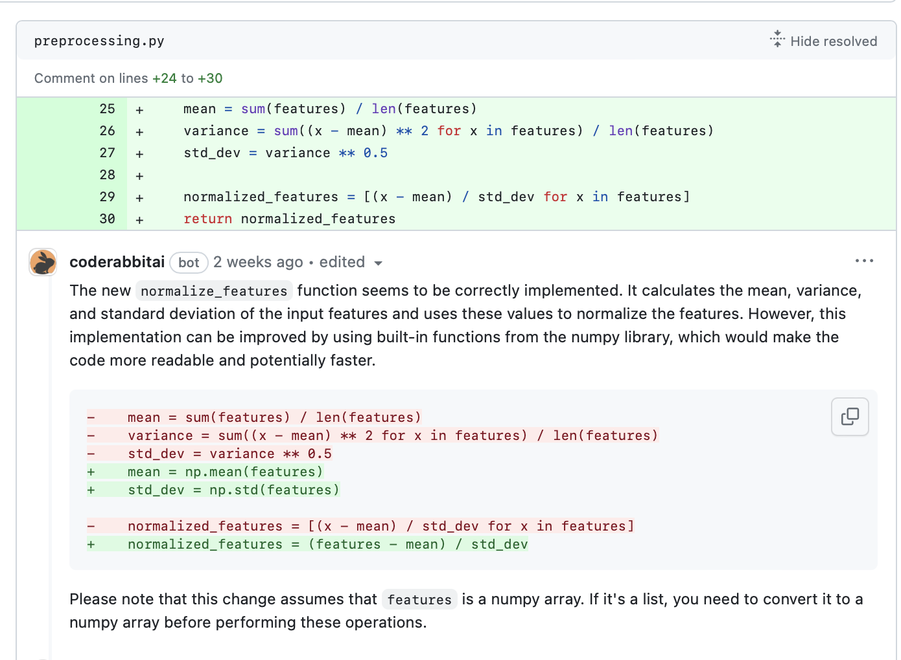

### 1. Pull Request Summary {#pull-request-summary}

Generated upon the creation of a pull request and subsequently updated with each
incremental request.

High-Level Summary: This offers a concise overview of the changes in the pull
request. It helps the team, including those without technical expertise, to
quickly understand the changes and the impact on the product.

Walkthrough: A detailed code walkthrough to understand the changes in each file
that is part of the pull request, followed by a celebratory poem about the
changes.

### 2. Code Review feedback {#code-review-feedback}

Review comments: Review feedback posts as pull request, review comments on the
lines of the code that changed under each file. Any code suggestions are given
in a Diff format, which either be copied or committed within the pull request
with a single click.

### 3. Chat with CodeRabbit {#chat-with-coderabbit}

CodeRabbit provides conversational capability that allows developers and the
reviewers to ask questions, generate code, and get feedback in the context of
changes. Just comment on the CodeRabbit review to start the conversation.
CodeRabbit learns from your interactions and gets smarter over time. The more
you chat, the better it gets.

### 4. Issue Validation {#issue-validation}

Pull request changes are validated against the linked GitHub or GitLab issue and
identifies all other issues which might be affected by this change.

### 5. Pull Request review status {#pull-request-review-status}

Review status is generated for each review, including a separate one for each
incremental commit. Displays the commit IDs that were reviewed, the files
examined and ignored, as well as the actionable feedback and additional comments
generated for each review.

For information on how to get started with CodeRabbit, visit
the [Get Started page](/get-started/signup)
