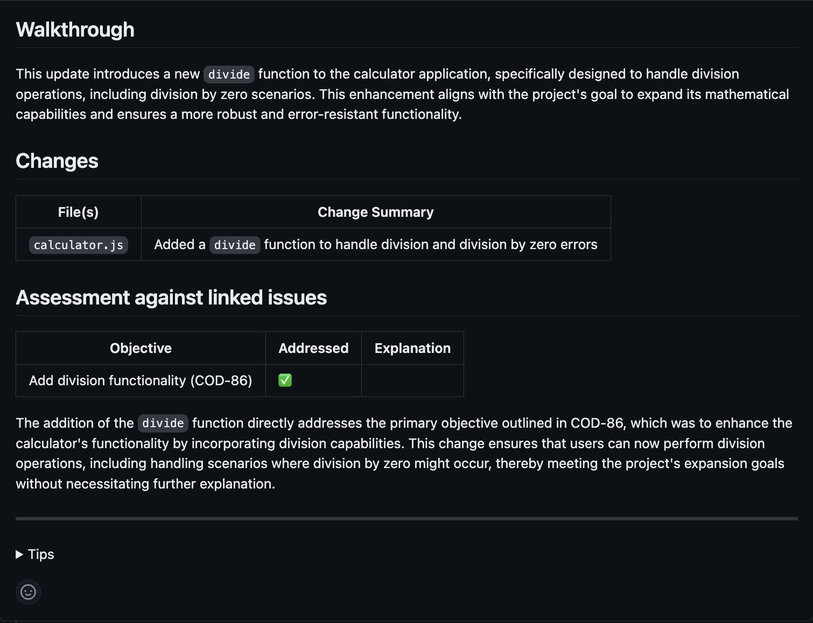

<head>
 <meta charSet="utf-8" />
  <meta name="title" content="Utilize CodeRabbit with Linear" />
  <meta name="description" content="Integrate CodeRabbit with Linear" />

  <meta property="og:type" content="website" />
  <meta property="og:url" content="https://coderabbit.ai/" />
  <meta property="og:title" content="Utilize CodeRabbit with Linear" />
  <meta property="og:description" content="CodeRabbit: AI-powered Code Reviews" />
  <meta property="og:image" content="/preview_meta.jpg" />

  <meta name="twitter:image" content="https://coderabbit.ai/preview_meta.jpg" />
  <meta name="twitter:card" content="summary_large_image" />
  <meta name="twitter:title" content="Utilize CodeRabbit with Linear" />
  <meta name="twitter:description" content="CodeRabbit: AI-powered Code Reviews" />
</head>

### Linking Issues

After successfully integrating CodeRabbit with Linear, you gain the ability to link Linear issues directly to your pull requests.

To link a Linear issue to a pull request, simply include the Linear Issue ID in the pull request description.

For instance:

Linear issue: **_COD-86_**

This indicates that the pull request addresses a specific issue, such as adding a new feature. In this simple example, the issue created on linear specified to implement the division functionality for the simple calculator.

When the pull request is submitted with the associated Linear Issue ID, CodeRabbit automatically retrieves the corresponding issue and evaluates whether the pull request fulfills its objectives.

:::info
You can view the assessment outcome in the Walkthrough section of CodeRabbit's Review.
:::

Upon posting the review findings, CodeRabbit provides details about the issue's objectives, confirms whether they were met, and offers additional explanations if needed. For example, here, the developer added the division functionality for the simple calculator in the pull request. CodeRabbit was able to find that issue, assess whether the pull request did indeed resolve the issue, and provided the assessment as seen below.

### Finding Related Issues

Another key feature of CodeRabbit's Linear integration is its ability to discover existing related Linear issues addressed in a pull request. Leveraging RAG (Retrieval-Augmented Generation) as described in [Jira Integration - Finding Related Issues](../Jira/link#finding-related-issues)
